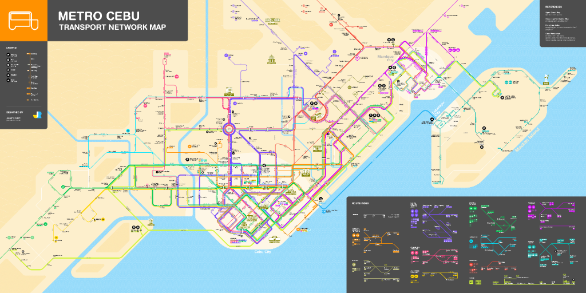

<p align="center">
  
</p>

<h1 align="center">JeepMe</h1>

<p align="center">
  <strong>Jeepney route finder for Metro Cebu, Philippines</strong>
</p>

<p align="center">
  <a href="https://nextjs.org">
    
  </a>
  <a href="https://react.dev">
    
  </a>
  <a href="https://www.typescriptlang.org/">
    
  </a>
  <a href="https://tailwindcss.com/">
    
  </a>
  <a href="https://leafletjs.com/">
    
  </a>
  <a href="LICENSE">
    
  </a>
</p>

<p align="center">
  <a href="https://recursivedev.github.io/JeepMe">
    
  </a>
  <a href="https://github.com/RecursiveDev/JeepMe/actions/workflows/ci.yml">
    
  </a>
  <a href="https://github.com/RecursiveDev/JeepMe/issues">
    
  </a>
  <a href="https://github.com/RecursiveDev/JeepMe/pulls">
    
  </a>
  <a href="https://github.com/RecursiveDev/JeepMe/commits/main">
    
  </a>
</p>

<p align="center">
  Interactive map • Fare estimation • OSRM-snapped routes • Metro Cebu route catalog
</p>

---

## Project status

This repository is under active development.

- ✅ Interactive route finder and route catalog are working.
- ✅ GitHub Pages deployment is enabled.
- ⏳ Route data accuracy and UX refinements are ongoing.

---

## What is JeepMe?

**JeepMe** is a modern web app that helps commuters find the best jeepney routes across **Metro Cebu, Philippines**.

It lets you pin an origin and destination on a map, then suggests jeepney routes based on proximity matching. It can also estimate fares and draw realistic paths by snapping route lines to real streets via OSRM.

---

## Key features

- **Route finder:** Pin origin/destination to find matching jeepney routes.
- **Fare estimation:** Simple distance-based estimate.
- **Street snapping:** Uses **OSRM (Open Source Routing Machine)** to draw routes aligned to streets.
- **Geocoding & search:** Uses **Nominatim (OpenStreetMap)** for place search and reverse geocoding.
- **Route library:** Includes a catalog of Metro Cebu jeepney lines.

---

## Repository layout

```text
C:/Repository/JeepMe/
├── src/
│   ├── app/                 # Next.js App Router routes
│   ├── components/          # UI components
│   └── lib/                 # Routing, OSRM, geocoding, data types
├── public/                  # Static assets
└── .github/workflows/        # CI + GitHub Pages
```

---

## Local development

```bash
npm install
npm run dev
```

Open: http://localhost:3000

---

## GitHub Pages

Live demo: https://recursivedev.github.io/JeepMe

Deployment is handled by: `.github/workflows/pages.yml`

---

## Contributing

See `CONTRIBUTING.md`.

If you're using agentic AI to contribute, read `AGENTS.md` first.

---

## Security

See `SECURITY.md`.

---

## License

MIT — see `LICENSE`.

---

## Disclaimer

Route data is approximate and based on commonly known jeepney paths. Actual routes may vary due to traffic rerouting or driver decisions. Fare information is estimated and may not match actual collections.
